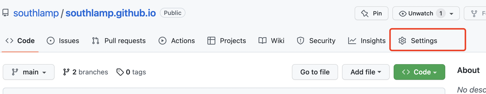

# 从零开发 npm 包及对应文档

### 分步

1. 使用 dumi 进行本地公共组件开发
2. npm 包发布
3. github pages 文档部署

### 实施

#### 一. dumi 本地公共组件开发

```js
// 通过官方工具创建项目，选择你需要的模板
$ npx create-dumi

// 选择一个模板
$ ? Pick template type
$ ❯   Static Site // 用于构建网站
$     React Library // 用于构建组件库，有组件例子
$     Theme Package // 主题包开发脚手架，用于开发主题包
```

上述模板可以可以选择第二个。

发布 npm 包主要用到项目中的`.fatherrc.ts`, 命令行执行 `npm run build`

文档部署主要用到项目中的`.dumirc.ts`, 命令行执行 `npm run docs:build`

关于 dumi 的具体配置参数可以参考文档[官方文档](https://d.umijs.org/config)

#### 二. npm 包发布

- 注册 npm 账号[官网链接](www.npmjs.com)
- 准备好自己要发的工具包
- 配置 package.json
  1. 注意 name 名称。建议可以先去 npm 官网搜一下自己定义的 npm 包名称是否有重复，如果重复的话发包会失败
  2. 注意 version 版本。多次 publish 需要调整 version 号
- 开始发包
  上述准备工作做好之后即可进行发包。

  1. 执行以下代码登陆 npm 账号，然后输入自己的注册用户信息
     `npm adduser`
  2. 发布 npm 包, 按照提示输入对应注册用户密码即可
     `npm publish`

#### 三. github pages 部署

##### 1.创建一个 github 账号

官网: [GitHub](https://github.com/)

接下来内容的官方教程链接: [GitHub Pages site](https://pages.github.com/)

##### 2. 创建库

GitHub 中任何页面的右上角都有一个加号，点击 "New repository"

##### 3. 库的名称

注意 Repository Name 一定要是 username.github.io, username 为 git 的用户名

##### 4. Clone

git 中的项目创建好之后,可以 clone 到本地进行开发, 或者直接使用本地已经准备好的 dumi 项目，把.git 文件复制粘贴过来即可

##### 5. 自动部署

利用 [Github Action](https://github.com/features/actions) 在每次 branch 分支更新后自动部署

新建 .github/workflows/gh-pages.yml 文件

```js
name: github pages

on:
  push:
    branches:
      - main // default branch

jobs:
  deploy:
    runs-on: ubuntu-18.04  // 注意此处ubuntu-18.04有可能会失败，如果失败可以改为ubuntu-latest
    steps:
      - uses: actions/checkout@v2
      - run: npm install
      - run: npm run build
      - name: Deploy
        uses: peaceiris/actions-gh-pages@v3
        with:
          github_token: ${{ secrets.GITHUB_TOKEN }}
          publish_dir: ./docs-dist
```

##### 6. git 提交

踩坑记录，有可能会提交 403 提示无权限。需要在 github 上面配置 develop token， 然后本地提交时将 token 作为密码输入。

##### 7. 调整 github 相关配置项

接下来,需要调整一下 github 相关配置。

首先找到 Settings, 然后去这个 tab 下面找到对应的 Pages



最后找到需要调整的地方


现在可以在 https://username.github.io/ 访问到文档页面了, 注意 username 为自己的用户名

然后使用 npm 的话可以通过 `npm install xxx` 进行使用

<font color="#dddd00">不积跬步，无以至千里。 不积小流，无以成江河。</font>

```tsx
import React from 'react';
import Talk from '../../talk.tsx';
export default () => <>{Talk('componentdoc')}</>;
```
