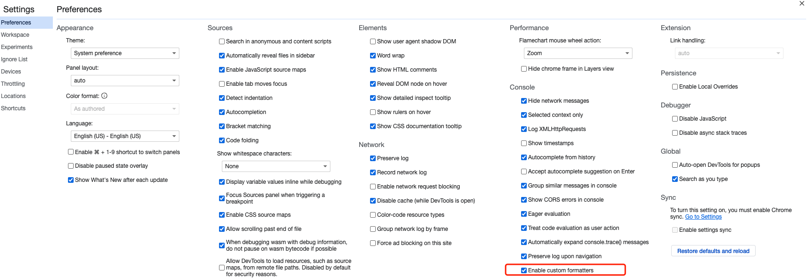
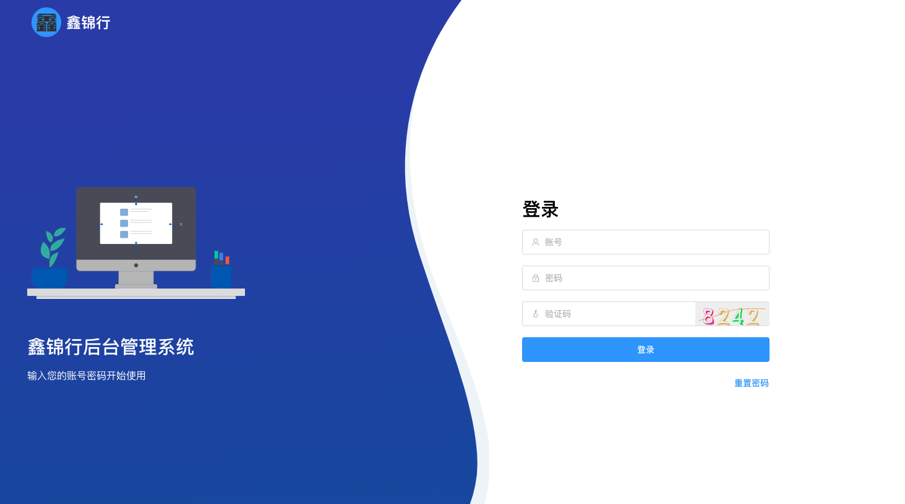

# easyLend 项目开发

&nbsp;&nbsp;&nbsp;&nbsp;最近前端已死和前端还活着的争论变成了主题, 追根到底还是卷的不行。为什么社区里面只有前端的论调? ui 和运维甚至都还能苟延残喘,前端却发出了哀嚎：前端已死，找工作好难啊。其实归根究底，就是各种内卷，卷的厉害。不只卷 996，甚至要求一个前端拥有更多的技能。甚至资本更希望，招了一个前端，你就把整个项目给完成了。 vocal!!

&nbsp;&nbsp;&nbsp;&nbsp;虽然已经做了好多年的前端，但是一直觉得前端的技术更新换代的快， 而且前端的知识面太窄，很少有机会接触到更多的东西。emo, 严重后悔了...

&nbsp;&nbsp;&nbsp;&nbsp;渣渣公司最近一段时间经历了一段狂风暴雨，裁员一连裁了两轮，也不知道该说是运气好还是不好，我竟然还活着？whta fuck ?? 但是说实话也是危机感迎面而来, 总在想着哪一天风雨就会来临，都跟留下来的几个同事做好了刷刷面试宝典的准备，随时准备迎接各种风雨到来。还是古话说的好,打铁还需自身硬。

&nbsp;&nbsp;&nbsp;&nbsp;最近，借着一个机会也算是体验了一把服务端开发，这里感谢不方便透露姓名的赞助商，感谢 !

&nbsp;&nbsp;&nbsp;&nbsp;好了, 言归正传, 直接进入主题，少扯闲篇

# 项目介绍

本次项目开发主要涉及前后端，其中前端包含移动端和管理端。

项目整体涉及到技术点：

uniapp + vue3.x + 腾讯云 Webify + 在线客服

Nodejs + Koa + 腾讯云 cloudBase(云函数 + 云数据库) + 短信

npm 包：因项目依赖需要，又单独开发了两个 npm 包 @southlamp/\* , 包名就不说了, 咱不打广告。哈哈，还特意给 npm 包加了一个 scope

## 公众号

### 1.技术栈

移动端是用了 uniapp + uview + vue3.x

功能点: 额度测算 + 短信验证码 + 在线客服功能

### 2.踩坑记录

上次使用 vue 还是两年多前吧。 当时还是 vue2.x, 现在都已经变成了 3.x。忆往昔, vue 用的嘎嘎的溜 ...

可惜，光忆往昔没有用, 面试官也不让忆， 就问现在的情况。所以老实的又把 vue3 给看了一遍。还好，还好，差别不是很大，还能看得懂。所以就拿着这个移动端项目练手了，然后交付给赞助商，反正赞助商也不懂。

一开始是打算做一个小程序，主要是看中了小程序的在线客服功能。 但是后来赞助商想要每月发布文章， 所以就选择了公众号。虽说赞助商想要的东西变了，但是咱选的框架不变，没办法，就是这么一个坚守初心的渣渣。

下面记录踩坑:

1. uniapp 真的是坑啊，官方文档对于 uniapp 的开发推荐两种方式 。 HbuilderX 和 vscode 。 其中 HbuilderX 算是亲儿子吧，但是说实话用惯了 vscode 的人真心接受不了 hbuilderX, 对于 ts 的支持也并不友好，所以毅然决然的放弃了第一种，转身投入了 vscode 的怀抱。

2. 在使用 vscode 的过程中 ,各种插件是也要注意。

- 安装 Vue Language Features (Volar) ：Vue3 语法提示插件
- 安装 TypeScript Vue Plugin (Volar) ：Vue3 的 TS 插件
- 工作区禁用 Vetur 插件(Vue2 插件和 Vue3 插件冲突)
- 工作区禁用 @builtin typescript 插件（禁用后自动开启 Vue3 的 TS 托管模式）
- 安装 uni-app 插件
- - uni-create-view ：快速创建 uni-app 页面
- - uni-helper ：uni-app 代码提示
- - uniapp 小程序扩展 ：鼠标悬停查文档

3. 重点说一下 uniapp 的 ui 选型。

   一开始准备选用 uniapp 自带的 uni-ui, 但是样式好丑，连我这么一个没有审美眼光的人都觉得很丑，差评！

   然后又瞄上了 Vant Weapp, 这个框架好嘿， 长得也好看, 我竟然眼瞎的没找到 form 组件，没有 form 那哪行，绝壁放弃。不过后来给证明(哥哥，我错了，你是有的，是我眼瞎，对不起，下次我肯定用用你)

   然后又换了 uview， 至此，算是最终定下来公众号基础框架 。

   接下来就没说的了，撸代码呗，有啥，踩坑点就在 vue3 中对于变量使用 ref 和 reactive 声明，这个自行百度，没啥说的。

4. 说一下在 vue3 中对于通过 console 打印出来的内容的查看。打印出来的内容，可读性太差。因为 vue3 和 vue2 对于响应式处理方案不一致，具体参考文档。但是解决方式很简单，可以设置谷歌浏览器，废话不多说，直接上图。
   

5. 说一下在线客服功能
   以前一直听说在线客服，但是并没有实际开发过，所以这次也算是给咱一个乡下人开了眼界。但是其实并不神奇，只是调用腾讯提供的 api 而已。腾讯在企业公众号中有在线客服功能。当然肯定是收费的，不收费的有接待客服数量限制。当企业微信认证完成之后就没有了数量限制。在企业微信中开通在线客服之后就可以获取对应的链接，然后直接将链接嵌入在公众号的自定义菜单中就可以。当用户点击自定义菜单中的链接时候，微信就会帮助跳转到对应的客服，而客服可以在企业微信中指定。

## 后台管理系统

### 1.技术栈

vue3.x + element-ui
功能点: 登陆 + 图形验证码 + 权限管理 + 常规增删改查

### 2.踩坑记录

其实对于管理端 , 是没有什么好描述的。大概所有的后台管理系统功能都类似，登陆/注册/权限管理/增删改查

因为我要弄的是一个内部使用的管理系统，所以并没有给开放注册功能。只是给提供了登录和修改密码。下面简单放一张图完事。

## 服务端

### 1.技术栈

Nodejs + Koa + 其他

1. @koa/cors， 解决跨域
2. @southlamp/\* ，自己开发的 npm 包, 目的抽取腾讯云函数中的依赖进 node_modules。 这里加了一个 scope, 因为在 @southlamp 下包含了中间件和 utils 两个 npm 包。
3. bcryptjs, 密码加密
4. dotenv，构建不同 env， 区分环境变量
5. joi， 校验前端传参格式
6. jsonwebtoken， 向前端下发 token 及校验
7. koa-log4, 打印错误日志 (并没有部署，直接使用了腾讯云开发提供的日志功能)
8. koa-session， 在开发图片验证码的时候将验证码信息直接传到前端浏览器中，用来后续比较判断
9. serverless-http， 用来将 nodejs 格式代码转化为云函数所需的 main 主入口
10. svg-captcha， 生成图形验证码

### 2.踩坑记录

1. 踩的第一个坑是关于图形验证码的校验，本地开发时候是好的，但是部署到云环境之后却一直无效(所谓的无效指的是图形验证码通过接口获取到了，但是一直校验一直失败)。后来排查原因是因为服务端在下发 session 的时候并没有存储到客户端浏览器中，原因是因为跨域，解决方案: @koa/cors。

2. 腾讯云数据库查询文档写的挺垃圾的，好多地方都没有仔细写，竟然还需要去翻小程序的云开发文档。这里做个备注。小程序云数据链接: [数据库查询](https://developers.weixin.qq.com/miniprogram/dev/wxcloud/reference-sdk-api/database/Collection.html)

## 运维

关于运维工作，仅作记录

1. 公众号申请，公众号认证
2. 企业微信申请， 企业微信认证
3. 域名备案
4. 网站备案
5. 公安备案
6. 前端项目部署 ( web 应用托管 + 静态网站托管) , 之所以采用两种部署方式，是因为其中一个前端项目无法自动化部署，因为腾讯 web 应用托管的 node 版本无法切换，造成在线 install 和 build 失败。已和腾讯技术确认，并且给补偿了 30 元代金券 😄。 所以需要手动打包 dist 之后上传到腾讯云环境。
7. 后端项目部署, 对于云函数只需要上传云函数就可以，然后配置 http 访问路径。另外注意就是对于公共依赖上传至图层。
8. 二级域名， dns 解析
9. 短信验证码, 对接使用腾讯云提供的短信功能。

## 期望

一方面因为目前没有使用 redis 和 gateway 的必要性，另外一方面也是因为赞助商没给这方面的预算。但是后续会尝试使用 redis 和 gateway，没人赞助的话渣渣要自己赞助了！！

努力总会有收获的, 只不过不知道这份收获什么时间会来到。
