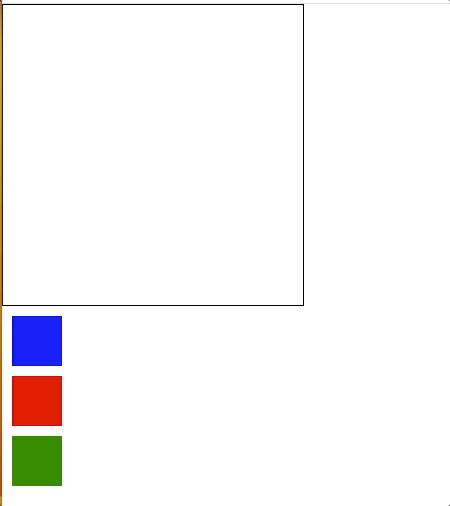
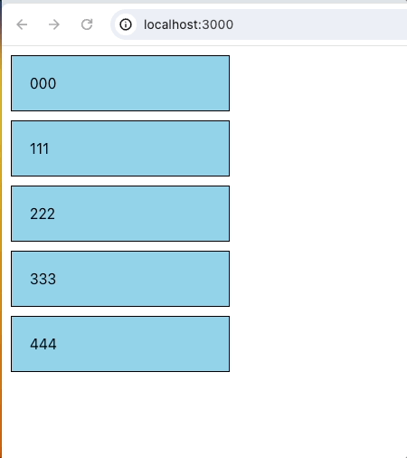
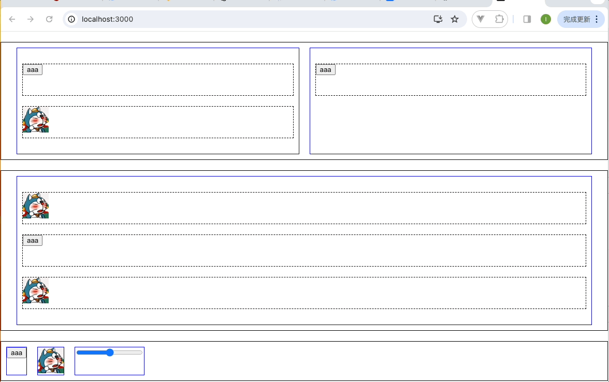

拖拽功能是经常碰到的需求, 在 react 里我们会用 react-dnd 来做。

不管是简单的拖拽，比如拖拽排序，或者复杂的拖拽，比如低代码编辑器，react-dnd 都可以搞定。

这篇文章我们就来用 react-dnd 来实现一下这些功能。

我们这篇文章会实现 3 个案例

# 演示

## 案例

### 案例一

简单拖拽和放下



### 案例二

拖拽且交换位置



### 案例三

简单的低代码编辑器


# 详述

## 代码

### 安装依赖包

```js
npm install react-dnd react-dnd-html5-backend

```

### 案例一分析
