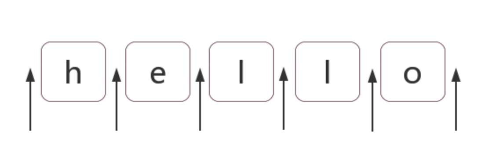

# JS 正则表达式

无意中从网上查找到一篇关于正则表达式的好文章，就进行了分享给大家，希望对大家有帮助。

想必你也了解正则的重要性，个人看来正则表达式是衡量程序员水平的一个侧面标准。

希望下面的文章会对阅读的人有一些帮助。

### 字符匹配

正则表达式是匹配模式，要么匹配字符，要么匹配位置 ！！

但是究竟如何去匹配字符，很多人也是有点晕，接下来会进行一个个人看法的阐述说明。

内容包括:

1. 两种模糊匹配
2. 字符组
3. 量词
4. 分支

#### 1. 两种模糊匹配

对于字符的模糊匹配，个人理解为横向的匹配和纵向的匹配两种, 因为单纯的去匹配精确的字符意义不是很大。

##### 1.1 横向模糊匹配

横向模糊匹配，指的是因为量词的存在，所以可匹配的字符串的长度是不确定的，可以是多种情况的，通常情况下是使用量词来实现匹配功能。

如 /ab{2,3}c/g 表示匹配这样一个字符串,第一个字符串是 a，接下里是 b，b 出现的次数可以是 2 次或者 3 次，然后一个字符是 c, 其测试的结果如下所示

```js
const regex = /ab{2,3}c/g;
const string = 'abc abbc abbbc';
console.log(string.match(regex));

//  ['abbc', 'abbbc']
```

注意上述正则表达式中的 g, 代表的是全局，如果不加的话则只会匹配第一个, 后续内容不再介绍 g 的含义

```js
const regex = /ab{2,3}c/g;
const string = 'abc abbc abbbc';
console.log(string.match(regex));

//  ['abbc']
```

##### 1.2 纵向模糊匹配

对于字符匹配来说, 如果只能匹配量词，那么正则的功能也不会如此强大，这就涉及到了正则的纵向模糊匹配，它可以帮助我们去匹配非精确字符。其实现的方式是用的字符组。比如[abc]可以匹配 "a","b","c"中的任意一个字符。

如 /a[123]b/ 可以匹配如下字符串 a1b a2b a3b, 测试如下

```js
const regex = /a[123]b/g;
const string = 'a0b a1b a2b a3b a4b';
console.log(string.match(regex));

//  ['a1b','a2b','a3b']
```

只要掌握了横向匹配和纵向匹配，在实际应用中已经可以解决了大部分的问题

#### 2. 字符组

这里对字符组概念做一个解释，虽然叫字符组，其实只是匹配一个字符。比如[abc]可以匹配 "a","b","c"中的任意一个字符。

##### 2.1. 范围表示法

在正则表达式中，我们常用连字符 '-' 来连接范围， 比如[a-z],[0-9],[A-Z]。

但是有时我们就是想要匹配 a,z,'-'三个字符中的任意一个,那么该怎么表述呢？当如下所示[-az]或者[az-]或者[a\-z], 对于"-"的位置，要么放在开头，要么放在结尾，要么放在中间进行转义。

##### 2.2 排除字符组

对于更多的应用场景，我们可能需要用到排除字符组。比如匹配除"a","b","c"以外的任意一个字符, 那么此时就可以表述为[^abc], 其中 "^"(脱字符)放在开头，用来表示非，即取反的概念。

##### 2.3 常见的简写形式

```js
\d就是[0-9]。表示是一位数字。记忆方式：其英文是digit（数字）。

\D就是[^0-9]。表示除数字外的任意字符。

\w就是[0-9a-zA-Z_]。表示数字、大小写字母和下划线。记忆方式：w是word的简写，也称单词字符。

\W是[^0-9a-zA-Z_]。非单词字符。

\s是[ \t\v\n\r\f]。表示空白符，包括空格、水平制表符、垂直制表符、换行符、回车符、换页符。记忆方式：s是space character的首字母。

\S是[^ \t\v\n\r\f]。 非空白符。

.就是[^\n\r\u2028\u2029]。通配符，表示几乎任意字符。换行符、回车符、行分隔符和段分隔符除外。记忆方式：想想省略号...中的每个点，都可以理解成占位符，表示任何类似的东西。
```

那么如何表示任意一个字符呢? [\s\S],[\d\D],[\w\W] 都可以用来表述

#### 3. 量词

量词理解起来相对简单一些，只需要记住以下的几种简写形式。

```js
1. {m,n} 表示次数从m次到n次都可以
2. {m} 表示m次
3. + 至少出现一次
4. * 可以出现，也可以不出现，出现的次数也随便你
5. ？出现或者不出现, 次数只能为0或1

```

##### 3.1 贪婪模式

说到了量词，那就不可避免的需要提到贪婪模式和非贪婪模式。我们都知道，对于正则匹配来说，其默认是贪婪的，即会尽最大的努力匹配更多的字符。比如/\d{2,5}/,会尽可能多的匹配，你有 5 个我就取 5 个，你有 4 个我就取 4 个，当然，有 6 个还是会取 5 个，测试结果如下所示

```js
const regex = /\d{2,5}/g;
const string = '123 1234 12345 123456';
console.log(string.match(regex));

// [123, 1234, 12345, 12345]
```

##### 3.2 非贪婪模式(惰性匹配)

既然有了贪婪模式，当然也就有了非贪婪模式，对于非贪婪模式的表达，是在量词后面加个"?"。意思是你知足了吗，你满足了吗。

对于非贪婪模式，它会尽可能匹配少的次数。还是对于/\d{2,5}?/, 虽然正则可以匹配 5 个数字，但是当匹配到了 2 个数字的时候，非贪婪模式就不会再继续进行匹配了，因为它已经满足了。

```js
const regex = /\d{2,5}?/g;
const string = '123 1234 12345 123456';
console.log(string.match(regex));

// [12, 12, 34, 12, 34, 12, 34, 56]
```

#### 4. 组合分支

通过了解对于横向模糊匹配和纵向模糊匹配，我们已经可以实现了部分的功能，但是有些时候单一的模糊匹配可能无法满足，那么我们就可以通过组合分支来实现。

这里组合分支是用"|",管道符来表述的。

比如[p1|p2|p3]，即只要字符符合 p1,p2,p3 中三个模式的任意一个模式，都会对字符进行匹配

比如/[hello|hello1]/g,测试如下

```js
const regex = /good|nice/g;
const string = 'good idea, nice try.';
console.log(string.match(regex));

// ['good', 'nice']
```

但是，我用/good|goodbye/，去匹配"goodbye"字符串时会发生什么呢？

```js
const regex = /good|goodbye/g;
const string = 'goodbye';
console.log(string.match(regex));

// ['good']
```

结果是只匹配到了 good

那么，我用/goodbye|good/，去匹配"goodbye"字符串时会发生什么呢？

```js
const regex = /goodbye|good/g;
const string = 'goodbye';
console.log(string.match(regex));

// ['goodbye']
```

结果是匹配到了 goodbye

从上述结果可以看出，对于分支组合来说，它也是惰性的，当匹配到了之后就不会再对组合中的下个模式进行匹配了。

### 位置匹配

上一章已经说过了，对于正则匹配来说, 要么匹配字符，要么匹配位置。上一章已经表述了对于字符的一些匹配，那么本章节表述一下对于位置的匹配。

1. 什么是位置
2. 如何取匹配位置
3. 位置的相关特性
4. 一些案例

#### 1. 什么是位置

简单的来说，位置就是相邻之间的字符之间的空隙，如下图箭头所示



#### 2. 如何匹配位置

在正则表达式中，通常对于位置匹配有 6 个锚点

```js
^ $ \b \B (?=p) (?!p)
```

##### 2.1 ^和$

^ (脱字符)，在多行匹配中通常用来匹配开头
$, 在多行匹配中通常用来匹配结尾

比如我们要把字符串的开头和结尾换成#

```js
const result = 'hello'.replace(/^|$/g, '#');
console.log(result);
// => "#hello#"
```

那假如我们要把字符串开头的首尾字母替换成#呢,该如何处理

```js
const result = 'hello'.replace(/^.|.$/g, '#');
console.log(result);
// => "#ell#"
```

##### 2.2 \b 与\B

\b 可以理解为单词边界，即\w 与\W 之间的空隙，\w 与^之间，\w 与$之间的空隙

举个例子, 比如一个字符串是"[JS] Lesson_01.mp4", 那么应用下\b 如下

```js
const str = '[JS] Lesson_01.mp4'.replace(/\b/g, '#');
console.log(str);

// "[#JS#] #Lesson_01#.#mp4#"
```

理解了\b， 那么\B 就好理解多了，可以理解为扣除 \b 之后剩余的部分，即 \w 与\w、\W 与\W、^与\W，\W 与$之间的位置

同样用字符串"[JS] Lesson_01.mp4"举例, 那么应用下\B 如下

```js
const str = '[JS] Lesson_01.mp4'.replace(/\B/g, '#');
console.log(str);

// "#[J#S]# L#e#s#s#o#n#_#0#1.m#p#4"
```

##### 2.3 (?=p)与(?!p)

(?=p),正向先行断言。

(?=p),p 是一个子模式, 表示符合 p 模式匹配的前面的位置。比如

```js
const result = 'hello'.replace(/(?=l)/g, '#');
console.log(result);
// "he#l#lo"
```

(?!p),负向先行断行, 就是(?=p)的反面意思,表示不符合 p 模式匹配的前面的位置

```js
const result = 'hello'.replace(/(?!l)/g, '#');
console.log(result);
// "#h#ell#o#"
```

#### 3. 位置的特性

其实对于位置，我们可以理解为一个空字符串，它不是某个具体的字符，但是其实是真是存在的

比如"hello"这个字符串，有如下几种表达形式

`"hello" == "" + "h" + "" + "e" + "" + "l" + "" + "l" + "o" + "";`

其等价于
`"hello" == "" + "" + "hello"`

因此，把/^hello$/写成/^^hello$$$/，是没有任何问题的：

```js
const result = /^^hello$$$/.test('hello');

console.log(result);

// => true
```

甚至可以写成更加复杂的形式, 比如

```js
const result = /(?=he)^^^he(?=\w)l(?=\w)lo$\b\b$/.test('hello');

console.log(result);

// => true
```

从上面可以看出来，对于字符之间的位置，可以理解为多个空字符串

#### 4. 一些案例

##### 4.1 不匹配任何东西的正则

`/.^/`
因为此正则要求只有一个字符，但该字符后面是开头。

##### 4.2 数字的千位分隔符表示法

比如把"12345678"，变成"12,345,678"。在前端的处理逻辑中，经常碰到需要对金额来处理显示，在这里对这个例子做出剖析。

###### 4.2.1 弄出最后一个逗号

使用/(?=(\d){3})$/

```js
const result = '12345678'.replace(/(?=\d{3}$)/g, ',');
console.log(result);
// 12345,678
```

###### 4.2.2 弄除所有逗号

使用/(?=(\d{3})+$)/

```js
const result = '12345678'.replace(/(?=(\d{3})+$)/g, ',');
console.log(result);
// 12,345,678
```

###### 4.2.3 去除首位的逗号

乍一看上面的测试结果是符合要求的，但是多做测试之后会发现有问题，比如

```js
const result = '123456789'.replace(/(?=(\d{3})+$)/g, ',');
console.log(result);
// ,123,456,789
```

所以我们需要去除掉首位的",",即匹配的位置不应该包含首位

可以使用/(?!^)(?=(\d{3})+$)/

```js
const result = '123456789'.replace(/(?!^)(?=(\d{3})+$)/g, ',');
console.log(result);
// 123,456,789
```

##### 4.2.4 其他形式

如果要把"12345678 123456789"替换成"12,345,678 123,456,789"。

```js
// 思路
// 1. 首先首尾不能有",", 可以考虑 \b 用单词边界来处理
// 2. /(?!\b)(?=(\d{3})+\b)/

const result = '12345678 123456789'.replace(/(?!\b)(?=(\d{3})+\b)/g, ',');
console.log(result);
// 12,345,678 123,456,789
```

#### 4.3 密码验证问题

密码长度 6-12 位，由数字、小写字符和大写字母组成，但必须至少包括 2 种字符。

##### 4.3.1 简化

密码长度 6-12 位，由数字、小写字符和大写字母组成
`/[0-9a-zA-Z]{6,12}/`

##### 4.3.2 是否同时包含某两种字符

`/(?=.*[0-9])(?=.*[a-z])^[0-9a-zA-Z]{6,12}/`

##### 4.3.3 题目拆分

1. 是否同时包含数字和小写
2. 是否同时包含数字和大写
3. 是否同时包含小写和大写
4. 同时包含数字，大写，小写

```js
const regex1 = /(?=.*[0-9])(?=.*[a-z])^[0-9a-zA-Z]{6,12}/;
const regex2 = /(?=.*[0-9])(?=.*[A-Z])^[0-9a-zA-Z]{6,12}/;
const regex3 = /(?=.*[A-Z])(?=.*[a-z])^[0-9a-zA-Z]{6,12}/;
const regex4 = /(?=.*[0-9])(?=.*[a-z])(?=.*[A-Z])^[0-9a-zA-Z]{6,12}/;

// 所以整体正则如下
const regex =
  /((?=.*[0-9])(?=.*[a-z])|(?=.*[0-9])(?=.*[A-Z])|(?=.*[A-Z])(?=.*[a-z])|(?=.*[0-9])(?=.*[a-z])(?=.*[A-Z]))^[0-9a-zA-Z]${6,12}/;

console.log(regex.test('1234567')); // false 全是数字

console.log(regex.test('abcdef')); // false 全是小写字母

console.log(regex.test('ABCDEFGH')); // false 全是大写字母

console.log(regex.test('ab23C')); // false 不足6位

console.log(regex.test('ABCDEF234')); // true 大写字母和数字

console.log(regex.test('abcdEF234')); // true 三者都有
```

##### 4.3.4 简化

至少两种字符的意思是，不能全部是数字/大写/小写,那么可以用

`/(?!^[a-z]{6,12}$)(?!^[A-Z]{6,12}$)(?!^[0-9]{6,12}$)^[0-9A-Za-z]{6,12}$/`

所以简化后的测试为

```js
const regex =
  /(?!^[a-z]{6,12}$)(?!^[A-Z]{6,12}$)(?!^[0-9]{6,12}$)^[0-9A-Za-z]{6,12}$/;
console.log(regex.test('abcdef')); // false 全是小写字母

console.log(regex.test('ABCDEFGH')); // false 全是大写字母

console.log(regex.test('ab23C')); // false 不足6位

console.log(regex.test('ABCDEF234')); // true 大写字母和数字

console.log(regex.test('abcdEF234')); // true 三者都有
```

### 括号的作用

因为括号的存在，正则显得更加的强大。其实简单来说，就是通过括号提供了分组，便于我们引用它。

1. 分组
2. 组合分支
3. 捕获分组
4. 非捕获分组
5. 反向引用

#### 1. 分组

括号最常用的情形就是用来分组, 比如我们知道/a+/可以用来匹配连续出现的字符"a",如果期望匹配连续出现的字符"ab",那么就 用到了分组功能 /(ab)+/。

```js
const regex = /(ab)+/g;
const string = 'ababa abbb ababab';
console.log(string.match(regex));

// ['abab', 'ab', 'ababab']
```

#### 2. 组合分支

在第一节中我们学习了组合分支功能，就是用到了括号的功能。比如我现在想要匹配 I Love Js 和 I Love NodeJs，那么就可以使用括号来进行组合分支

```js
const regex = /I Love (Js|NodeJs)/g;
const string = 'I Love Js, I Love NodeJs';
console.log(string.match(regex));

// ['I Love Js', 'I Love NodeJs']
```

#### 3. 捕获分组

这是括号在正则中的一个很重要的作用, 它可以让我们在进行数据提取，及替换的功能。

以日期为例，假设格式是 yyyy-mm-dd 的，我们可以先写一个简单的正则：

`const regex = /(\d){4}-(\d){2}-(\d){2}/`

##### 3.1 提取数据

```js
const regex = /(\d{4})-(\d{2})-(\d{2})/;
const string = '2017-06-12';
console.log(string.match(regex));

// ['2017-06-12', '2017', '06', '12', index: 0, input: '2017-06-12', groups: undefined]
```

同时，也可以使用构造函数的全局属性$1 至$9 来获取：

```js
const regex = /(\d{4})-(\d{2})-(\d{2})/;
const string = '2017-06-12';
string.match(regex);
console.log(RegExp.$1); // "2017"
console.log(RegExp.$2); // "06"
console.log(RegExp.$3); // "12"
```

##### 3.2 替换数据

该方法长用在字符串的 replace 方法中。

如果我们想要把日期格式转换为 mm/dd/yyyy 应该怎么做？

```js
const regex = /(\d{4})-(\d{2})-(\d{2})/;
const string = '2017-06-12';
string.replace(regex, '$2/$3/$1');
// 其中,"$1", "$2", "$3"代指分组获取到的值。
```

#### 4. 非捕获分组

对于捕获分组, 我们已经了解了其捕获的意义，主要是为了提取数值及替换的功能实现。但是有些时候其实根本不需要提取数值或者替换的功能，此时就可以只分组，不捕获。

```js
const regex = /(?:ab)+/g;
const string = 'ababa abbb ababab';
console.log(string.match(regex));
// => ["abab", "ab", "ababab"]
```

#### 5. 反向引用

对于 3 中描述的捕获分组的使用，需要借助与 API 上下文的环境才可以使用。但是其实我们在正则表达式本身里面也可以使用分组。

比如要写一个正则，支持匹配如下所示

```js
2016-06-12

2016/06/12

2016.06.12
```

我们脑子中第一想法应该就是

```js
const regex = /\d{4}(-|\/|.)\d{2}(-|\/|.)\d{2}/;
const string1 = '2017-06-12';
const string2 = '2017/06/12';
const string3 = '2017.06.12';
const string4 = '2016-06/12';

console.log(regex.test(string1)); // true

console.log(regex.test(string2)); // true

console.log(regex.test(string3)); // true

console.log(regex.test(string4)); // true
```

这样就造成了最后一个匹配字符串"2016-06/12"的错误，那么对于这种后面的匹配需要依赖与前面的匹配的处理，则可以使用正则表达式中的反向引用。

```js
const regex = /\d{4}(-|\/|.)\d{2}\1\d{2}/;
const string1 = '2017-06-12';
const string2 = '2017/06/12';
const string3 = '2017.06.12';
const string4 = '2016-06/12';

console.log(regex.test(string1)); // true

console.log(regex.test(string2)); // true

console.log(regex.test(string3)); // true

console.log(regex.test(string4)); // false
```

注意上述正则中的"\1", 它表示无论前面"(-|\/|.)"匹配到的是哪一个字符，\1 都对其进行引用，都匹配那个具体的字符。

同样也就可以理解\2,\3,\4 ...

但是，如果有括号嵌套的话怎么办呢？

###### 5.1 反向引用的括号嵌套

```js
const regex = /^((\d)(\d(\d)))\1\2\3\4$/;

const string = '1231231233';

console.log(regex.test(string)); // true

console.log(RegExp.$1); // 123

console.log(RegExp.$2); // 1

console.log(RegExp.$3); // 23

console.log(RegExp.$4); // 3
```

下面对上述的正则进行分析

- 第一个\d 为 1
- 第二个\d 为 2
- 第三个\d 为 3
- \1 为"123"
- \2 为"1"
- \3 为"23"
- \4 为"3"

学完这三章，可以做些案列来做自己的成果进行些检验

<font color="#dddd00">纸上得来终觉浅，绝知此事要躬行。</font>

```tsx
import React from 'react';
import Talk from '../../talk.tsx';
export default () => <>{Talk('regexp')}</>;
```
