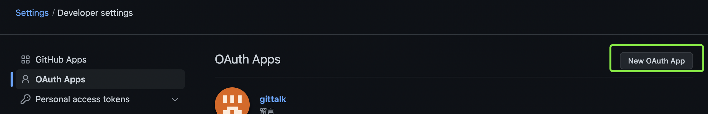
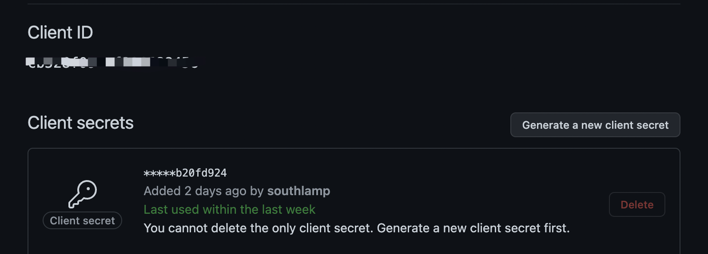

# Gitalk 评论的搭建使用

记录一下自己是如何使用 gitalk 在 github pages 上面使用评论功能

### 1. 注册 Github Application

所谓工欲善其事，必先利其器。我们需要先准备 gitalk 应用需要的相关密钥。

1. 登陆 github，然后右上角选择 settings

2. 选择左侧菜单 Developer settings

3. 进行相关的密钥生成，如下图所示, 进入到 Oauth Apps， 然后选中 New Oauth App



然后填写表单中的相关数据


其中 Homepage url 为使用的使用的项目地址。

Authorization callback Url 为需要回调的地址。

在 Github Pages 中通常设置为相同。

点击 Register application 后会生成如下所示的密钥。



注意: Client secrets 需要记住，因为其仅会在初次创建的时候展示，下次再进入查看的时候不会再展示，如果忘了只能重新生成。

### 2. 应用

弹药准备好之后就可以开干了，下面就是如何把弹药装进到我们的武器中使用。

#### 2.1 Install

`npm i --save gitalk`

#### 2.2 Useage

```js
import GitalkComponent from 'gitalk/dist/gitalk-component';

<GitalkComponent
  options={{
    clientID: '...',
    // ...
    // options below
  }}
/>;
```

选项

- clientID String

  必须. GitHub Application Client ID.

- clientSecret String

  必须. GitHub Application Client Secret.

- repo String

  必须. GitHub repository.

- owner String

  必须. GitHub repository 所有者，可以是个人或者组织。

- admin Array

  必须. GitHub repository 的所有者和合作者 (对这个 repository 有写权限的用户)。

- id String

  Default: location.href.

  页面的唯一标识。长度必须小于 50。

- number Number

  Default: -1.

  页面的 issue ID 标识，若未定义 number 属性则会使用 id 进行定位。

- labels Array

  Default: ['Gitalk'].

  GitHub issue 的标签。

- title String

  Default: document.title.

  GitHub issue 的标题。

- body String

  Default: location.href + header.meta[description].

  GitHub issue 的内容。

- language String

  Default: navigator.language || navigator.userLanguage.

  设置语言，支持 [en, zh-CN, zh-TW]。

- perPage Number

  Default: 10.

  每次加载的数据大小，最多 100。

- distractionFreeMode Boolean

  Default: false。

  类似 Facebook 评论框的全屏遮罩效果.

- pagerDirection String

  Default: 'last'

  评论排序方式， last 为按评论创建时间倒叙，first 为按创建时间正序。

- createIssueManually Boolean

  Default: false.

  如果当前页面没有相应的 isssue 且登录的用户属于 admin，则会自动创建 issue。如果设置为 true，则显示一个初始化页面，创建 issue 需要点击 init 按钮。

- proxy String

  Default: https://cors-anywhere.herokuapp.com/https://github.com/login/oauth/access_token.

  GitHub oauth 请求到反向代理，为了支持 CORS。 为什么要这样?

- flipMoveOptions Object

  Default:

  ```js
  {
    staggerDelayBy: 150,
    appearAnimation: 'accordionVertical',
    enterAnimation: 'accordionVertical',
    leaveAnimation: 'accordionVertical',
  }
  ```

- enableHotKey Boolean

  Default: true.

  启用快捷键(cmd|ctrl + enter) 提交评论.

官网: [Gitalk](https://github.com/gitalk/gitalk)

### 3. 踩坑

不踩坑的抄袭，不是好抄袭。下面说一下自己在使用过程中遇到的坑。

我这边遇到的问题主要是如下图所示:


第一次碰到之后一脸懵逼，完全照着文档开发也不明白自己错在了哪里，开始一番排查，也没有个头绪。

直接说解决方案，敲黑板 !!!

gitalk 在调用接口时候默认有个 label 标签 Gitalk, 除此之外，还有一个 label 标签是需要和每个使用的页面相对应的。 通常默认是 location.href。 但是我觉得不是很方便，所以我将默认的 id 改为通过在引用处传值给 id。

其次，需要在 github 对应的存储仓中建立对应的 issue ， 并且给该 issue 添加相对应的标签。如下图


OK, 刷新一下，成功！

```tsx
import React from 'react';
import Talk from './talk.tsx';
export default () => <>{Talk('')}</>;
```
