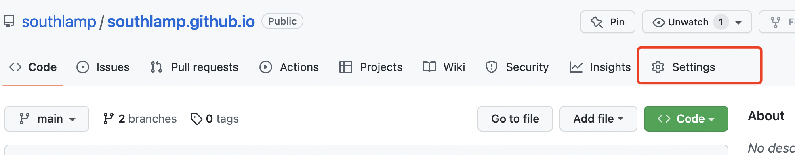
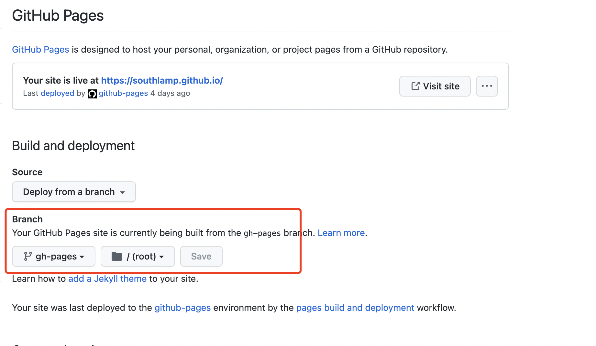

# GitHub Pages 搭建

记录一下自己是如何使用 dumi 搭建的第一个 github pages

### 1. 创建一个 github 账号

官网: [GitHub](https://github.com/)

接下来内容的官方教程链接: [GitHub Pages site](https://pages.github.com/)

### 2. 创建库

GitHub 中任何页面的右上角都有一个加号，点击 "New repository"

### 3. 库的名称

注意 Repository Name 一定要是 username.github.io, username 为 git 的用户名

### 4. Clone

git 中的项目创建好之后,可以 clone 到本地进行开发, 然后在本地创建 dumi 项目

### 5. 创建 dumi 项目

具体可以参考官网: [官网](https://d.umijs.org/guide/initialize)

另外此处我用的模式是 doc, 以后集成的时候再考虑 site, 反正切换模式也很简单。

然后关于 dumi 的开发使用可以见官方文档, 这里就不再啰嗦了。

### 6. 自动部署

敲黑板, 重点来了！！！

利用 [Github Action](https://github.com/features/actions) 在每次 branch 分支更新后自动部署

新建 .github/workflows/gh-pages.yml 文件

```javascript
name: github pages

on:
  push:
    branches:
      - main # default branch

jobs:
  deploy:
    runs-on: ubuntu-18.04
    steps:
      - uses: actions/checkout@v2
      - run: npm install
      - run: npm run build
      - name: Deploy
        uses: peaceiris/actions-gh-pages@v3
        with:
          github_token: ${{ secrets.GITHUB_TOKEN }}
          publish_dir: ./dist
```

### 7. 调整 github 相关配置项

接下来,需要调整一下我们的 github 相关配置。

首先找到 Settings, 然后去这个 tab 下面找到对应的 Pages



最后找到需要调整的地方



OK, 搞定收工。 现在可以在 https://username.github.io/ 访问到你的页面了, 注意 username 为你自己的用户名

```tsx
import React from 'react';
import Talk from './talk.tsx';
export default () => <>{Talk('home')}</>;
```
